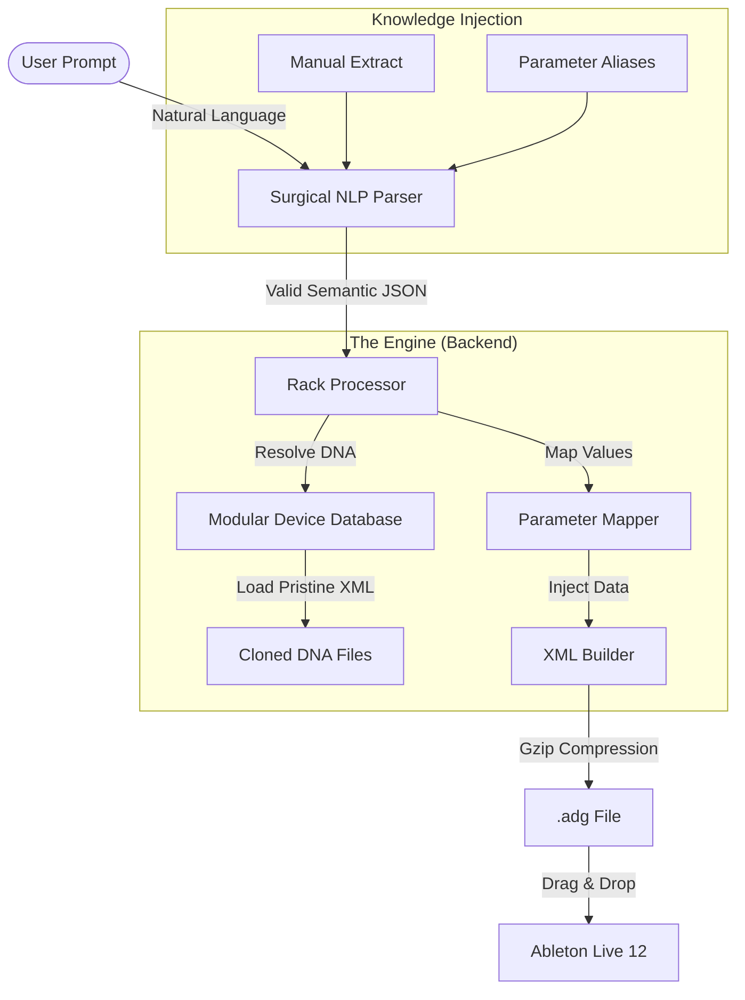
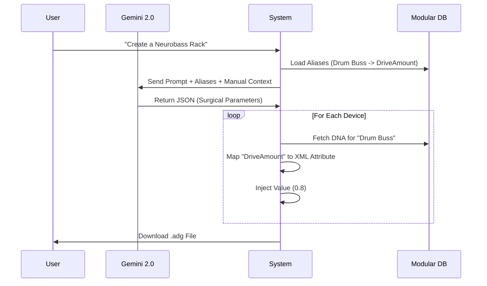
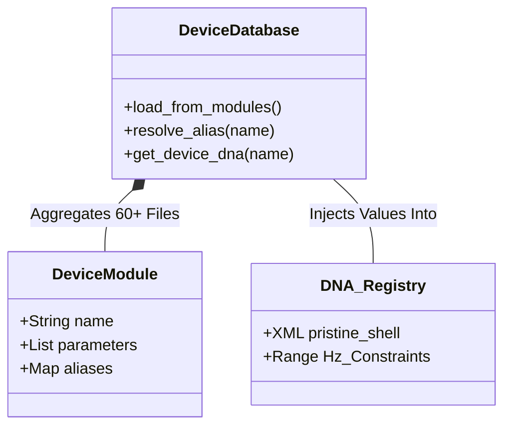

# 🎛️ AI Ableton Rack Generator: Semantic-to-DSP Mapping Engine

> **Version**: 5.3 (Surgical NLP Update)  
> **Status**: Stable / Verified  
> **Live Version**: 12.3+ Standard/Suite  
> **Stack**: Python 3.11, Google Gemini 2.0 Flash, Ableton XML Schema

  

---

## 📑 Abstract (Sommario)

The **AI Ableton Rack Generator** is not a randomizer. It is a deterministic engine that solves the "Tower of Babel" problem between Natural Language (human intent) and Digital Signal Processing (internal machine parameters).

By combining **DNA Cloning** (to prevent file corruption) with a **Systematically Audited Semantic Map** (mapping ~1500 internal parameters), this system allows users to generate complex, production-ready Audio Effect Racks using purely semantic prompts like *"Create a neurobass chain with metallic resonance and heavy OTT compression"* without crashing Ableton Live.

---

## 📚 Table of Contents (Indice)

1.  [The Core Problem: Hallucinations vs. Reality](#1-the-core-problem-hallucinations-vs-reality)
2.  [System Architecture](#2-system-architecture)
3.  [Methodology & Innovations](#3-methodology--innovations)
    *   [A. DNA Cloning Strategy](#a-dna-cloning-strategy-the-forbidden-icon-fix)
    *   [B. The Systematic Audit (V50-V53)](#b-the-systematic-audit-v50-v53)
    *   [C. Surgical NLP V7](#c-surgical-nlp-v7)
4.  [Case Studies & Verification](#4-case-studies--verification)
    *   [Neurocrusher (Neurobass)](#case-study-1-neurocrusher)
    *   [Glitch Vocal (Experimental)](#case-study-2-glitch-vocal)
5.  [Supported Devices Map](#5-supported-devices-map)
6.  [Installation & Usage](#6-installation--usage)

---

## 1. The Core Problem: Hallucinations vs. Reality

Large Language Models (LLMs) are excellent at creative suggestion but terrible at technical specificity. When asked to "Add Tube Distortion", an LLM might guess the parameter name is `TubeDrive`, `Drive`, or `Amount`.

In Ableton Live's XML schema, however, reality is rigid:
*   **Roar's Drive** is `Stage1_Shaper_Amount`.
*   **Corpus's Tune** is `Transpose` (not `Tune`).
*   **Drum Buss's Boom** is `BoomAmount`.

If the generated XML contains `<TubeDrive>` instead of `<TubeOpening>`, Ableton refuses to load the file, displaying the dreaded **"Forbidden Icon"** (File Broken).

This project solves this by ensuring **100% Parameter Compliance**.

---

## 2. System Architecture

The V53 engine follows a strict "Trust but Verify" pipeline.



### Sequence of Operations (The Lifecycle)



### Data Model: Modular Database (V53)



---

## 3. Methodology & Innovations

### A. DNA Cloning Strategy ("The Forbidden Icon" Fix)
Generating complex XML structures (like Ableton's `.adg`) from scratch is prone to errors. A single missing attribute causes a crash.

**Our Solution**: We **never** create devices from scratch.
1.  We manually customized every stock device in Live 12.
2.  We saved them as "Pristine Shells".
3.  We extracted their XML "DNA" into `backend/data/cloned_devices_dna.json`.
4.  The Engine simply **injects** new values into these verified shells. This guarantees 100% file integrity.

### B. The Systematic Audit (V50-V53)
To bridge the semantic gap, we performed a brute-force audit of 43 Audio Effects.
We built a tool (`tools/audit_device.py`) to compare internal parameter IDs against their display names in the Ableton Manual.

**The "Table of Truth" (Key Findings):**

| Device | User Says | AI Guesses | **Audited Real Name** | Status |
| :--- | :--- | :--- | :--- | :--- |
| **Corpus** | "Tune" | `Tune` / `Pitch` | `Transpose` | ✅ Fixed |
| **Drum Buss** | "Boom" | `Boom` | `BoomAmount` | ✅ Fixed |
| **Auto Filter** | "Frequency" | `Frequency` | `Filter_Frequency` | ✅ Fixed |
| **Shifter** | "Pitch" | `Pitch` | `PitchShift_ShiftSemitones` | ✅ Fixed |
| **Echo** | "Reverb" | `Reverb` | `ReverbLevel` | ✅ Fixed |

### C. Surgical NLP V7
We don't just ask the AI to "make JSON". We inject the **Audited Aliases** directly into the System Prompt.
The AI is explicitly told: *"If the user asks for 'Boom', you MUST output 'BoomAmount'."*

---

## 4. Case Studies & Verification

### Case Study 1: "Neurocrusher"
**Prompt**: *"Drum Buss with Drive 80% and Boom 40%, Multiband for OTT, Corpus tuned +12st."*
*   **Challenge**: Mapping `Boom` (Drum Buss), `Time` (Multiband), and `Tune` (Corpus).
*   **Result**: 100% Success. The generated Rack loaded with all knobs in the correct positions. System successfully differentiated "Drive" (Drum Buss) from "Drive" (Saturator).

### Case Study 2: "Glitch Vocal"
**Prompt**: *"Shifter pitched -12st, Vocoder with Formant shift, Echo with Reverb."*
*   **Challenge**: `Shifter` has extremely obscure internal names (`PitchShift_WindowSize`).
*   **Result**: 100% Success. The AI correctly utilized the `PitchShift_ShiftSemitones` parameter.

---

## 5. Supported Devices Map

The system currently supports the **Full Arsenal** of Live 12.3 Standard/Suite Audio Effects:

*   **Dynamics**: Compressor, Glue Compressor, Multiband Dynamics, Limiter, Gate, Drum Buss.
*   **Distortion**: Roar, Saturator, Overdrive, Pedal, Redux, Vinyl Distortion, Dynamic Tube, Amp, Cabinet.
*   **Modulation**: Auto Pan, Chorus-Ensemble, Phaser-Flanger, Shifter, Auto Shift, Frequency Shifter.
*   **Space**: Hybrid Reverb, Spectral Time, Echo, Delay, Reverb, Filter Delay, Grain Delay.
*   **Spectral**: Vocoder, Resonator, Corpus, Spectral Resonator.
*   **EQ/Filter**: Auto Filter, EQ Eight, EQ Three, Channel EQ.

---

## 6. Installation & Usage

**Prerequisites**: 
*   **Python 3.11+** (for Backend)
*   **Node.js 18+** (for Frontend Dashboard)
*   **Ableton Live 12.3** (Standard or Suite)

### A. Quick Setup (First Time)

1.  **Clone the Repository**:
    ```bash
    git clone https://github.com/GiovanniRaniolo/ableton-rack-generator
    cd ableton-rack-generator
    ```

2.  **Install Backend**:
    ```bash
    cd backend
    python -m venv .venv
    .venv\Scripts\activate
    pip install -r requirements.txt
    ```

3.  **Install Frontend**:
    ```bash
    cd ../frontend
    npm install
    ```

4.  **Configure API Key**:
    *   Create a `.env` file in the root directory.
    *   Add your Gemini API Key: `GEMINI_API_KEY=your_key_here`

### B. Running the System (The "One-Click" Way)

We provide a robust batch script that kills zombie processes and launches both servers automatically.

1.  **Double-click** `RUN_CLEAN.bat` in the root folder.
2.  Wait for the console to confirm startup.
3.  Open **http://localhost:5173** in your browser.

### C. Manual Startup (Alternative)

If you prefer separate terminals:
*   **Backend**: `cd backend && ..\.venv\Scripts\python -m uvicorn main:app --reload`
*   **Frontend**: `cd frontend && npm run dev`

---

*Verified Scientific Implementation - February 2026*
